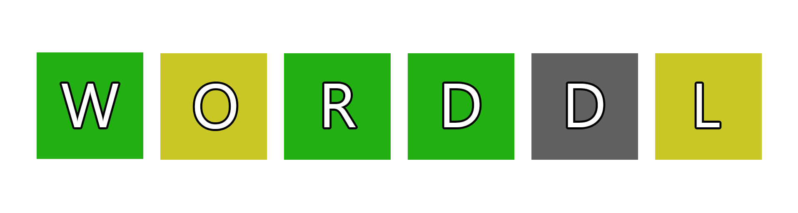
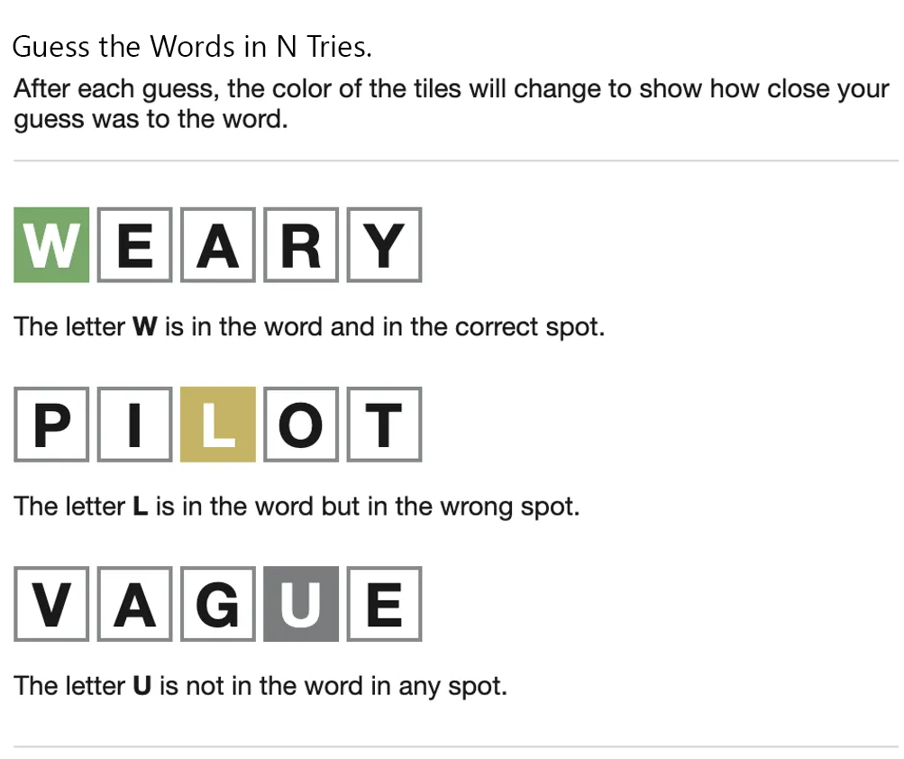
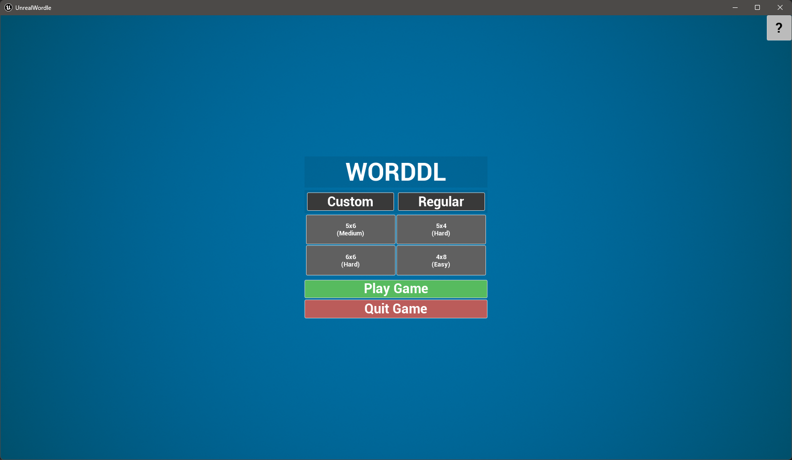
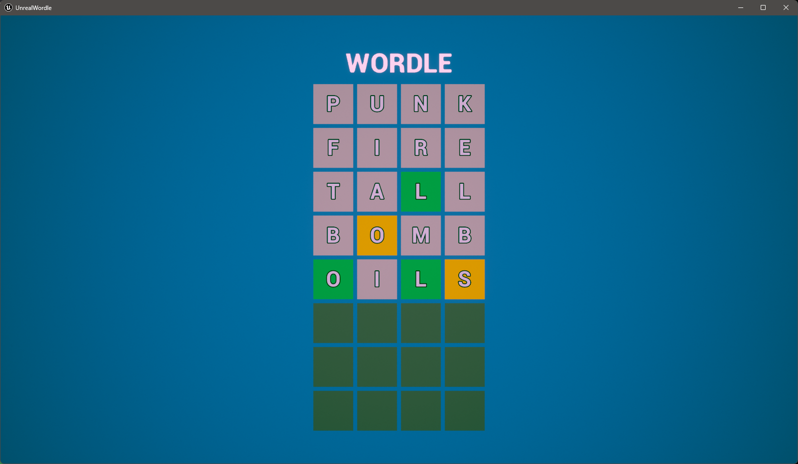
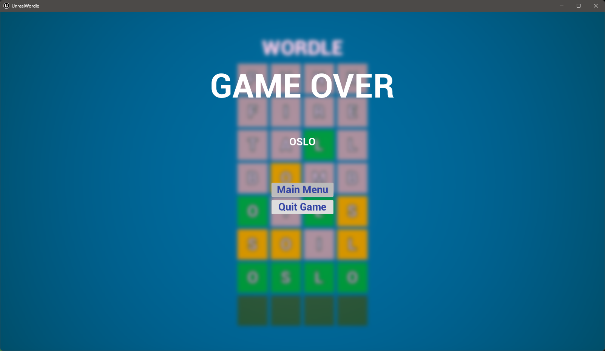
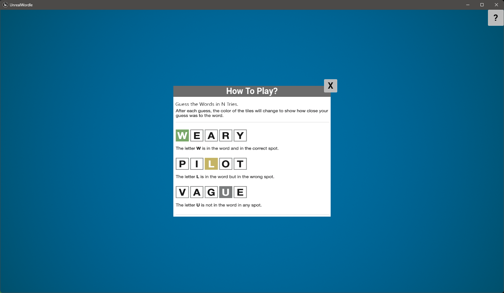

# UnrealWordle

> **
Fig1 - Logo for WORDLE Game
**

## About

The game is inspired by Wordle, a web-based word game by [Josh Wardle](https://en.wikipedia.org/wiki/Josh_Wardle). The original was inspired by color matching game Mastermind.

The entire project was made using Unreal Engine's C++ and Blueprints working in Compatibility. While most of the Logic and Handling is in C++, UI Design and Animations were made using Blueprints for ease to handle.

> **NOTE**: Find the __Build__ of the Game in GitHub Releases and Let me know the Feedback through Issues on the Repository. :)

The __Rules__ for the Same are Enumerated below:

> **
Fig2 - Rules for Playing
**

## Features

* Easily Customizable User Interface
* Really Fast Parsing of Text using C++
* Sophisticated String Comparision Algorithm
* Customizable Board
* Easy to Recreate Animations

## Screenshots

> **
Fig3 - Main Menu - Regular Modes
**

> **
Fig4 - InGame 4x8 Easy Mode
**

> **
Fig5 - Game Over (Win/Lose)
**

> **
Fig6 - InGame Instructions
**

## Development

### Tools
* Unreal Engine 5.1
* MSVC v143
* JetBrains Rider 2022 IDE

### Author
Kushagra __"negProt"__ Prakash